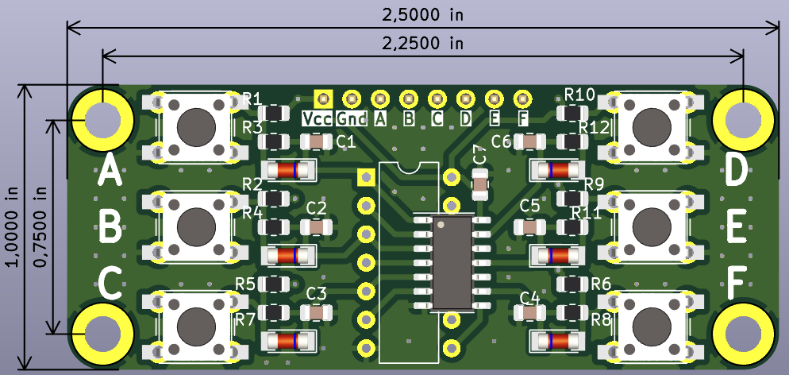

# Module of 6 push-buttons with hardware bebouncing

This "mini-project" was inspired by [this tutorial](https://soldernerd.com/2014/11/12/switch-debouncing-using-74hc14/) and contains a few modifications:
- use either SMD ot THT buttons
- use either SMD or DIP IC
- add recommended diodes (but they are fully optional for soldering) as per [this](https://my.eng.utah.edu/~cs5780/debouncing.pdf)

## Layout and dimentions

| Top View	| Bottom View |
| ----- | ----- |
|  |  |

- overall dimensions: 1.0 in × 2.5 in
- mounting holes spacing : 0.75 in × 2.25 in
- mounting holes size : M3
- SMD sized:
	- Resistors: 0805
	- Capacitors : 0805
	- Diodes : MiniMELF